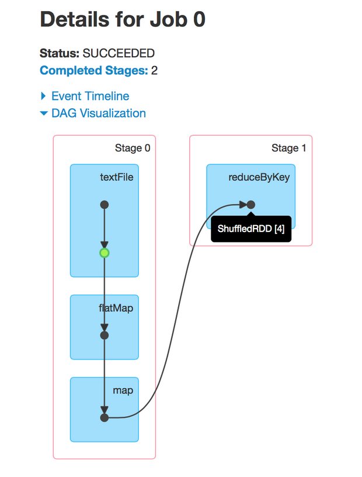

## spark 程序中stage是如何划分的

又重新复习了一下`spark` 程序中`job, stage, task`之间的关系。首先明确基本概念:

> job由stage组成, stage由task 组成

以wordcount为例进行解析：

> sc.textFile("path/to/your/text/file").flatMap(_.split(" ")).map((_, 1)).reduceByKey(_+_).collect()

* 首先是`job`的划分

从图中可以看到`wordcount`只划分了一个`Job0`, 在`spark`中, `job`的数量由该程序中的`action`算子决定,
也就是说在最后的`collect`算子触发了一个`job`, 如果没有`action`就不会触发`SparkContext`中的`runJob`方法

* `stage`的划分

`stage`的划分是根据`RDD`之间的宽窄依赖判断的, 如果`RDD`之间是宽依赖(后一个`RDD`的产生需要进行`shuffle`操作), 那么这里会产生一个
`stage`的分界

